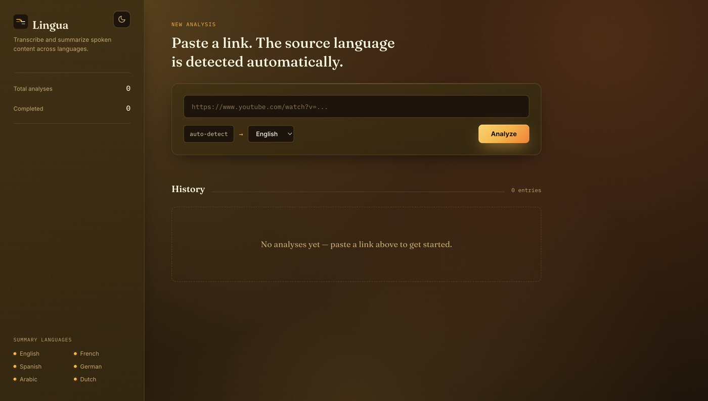
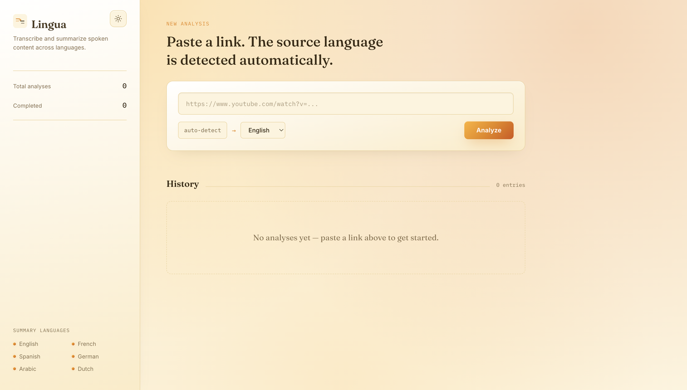

# Lingua — Multilingual Content Analyzer

A tool that automatically transcribes and summarizes YouTube videos in any
language. Paste a link, and it downloads the audio, transcribes it with
automatic language detection (via Whisper), and generates a summary with key
points — written in a language of your choice (via a local LLM with Ollama),
independent of the video's original language.

Includes a dashboard with live progress, a deletable analysis history, a
detail page with the full transcript, and a dark/light theme toggle.

|                          Dark mode                          |                          Light mode                           |
| :-----------------------------------------------------------: | :------------------------------------------------------------: |
|  |  |

## Why this project?

Started as an Arabic-focused NLP tool — Arabic speech-to-text and
summarization tools are scarce compared to English ones — and grew into a
general-purpose multilingual analyzer. Whisper detects the spoken language
automatically; summaries are available in six languages: English, French,
Spanish, German, Arabic, and Dutch.

## Architecture

```
YouTube URL --> yt-dlp (audio download) --> faster-whisper (transcription,
                                              auto language detection)
            --> Ollama / local LLM (summary in chosen language) --> SQLite (storage)
                                                                  --> Dashboard (HTML/JS)
```

Processing runs asynchronously: you immediately get a `job_id` back and can
poll the status until the job is done. All jobs persist in SQLite, so history
survives restarts. The video's language is detected automatically; the
summary language is chosen independently when starting an analysis.

## Requirements

- Python 3.10+ (for running locally) or Docker (for running containerized)
- [Ollama](https://ollama.com) installed and running on the host machine
- ffmpeg installed (needed for audio extraction by yt-dlp) — local only; already included in the Docker image

## Option A: Run locally

```bash
# 1. Create a virtual environment
python -m venv venv
source venv/bin/activate  # Windows: venv\Scripts\activate

# 2. Install dependencies
pip install -r requirements.txt

# 3. Pull the Ollama model
ollama pull qwen2.5:7b

# 4. Create .env (optional, defaults are used otherwise)
cp .env.example .env
```

Start the server:

```bash
uvicorn app.main:app --reload
```

Open the dashboard by opening `dashboard/index.html` in your browser (e.g.
`open dashboard/index.html` on macOS).

## Option B: Run with Docker

Ollama runs on the host machine (not in the container), since it needs
GPU/Metal acceleration that doesn't work well in a container on macOS. The
container talks to Ollama via `host.docker.internal`.

```bash
# 1. Make sure Ollama is running on your host with the right model
ollama pull qwen2.5:7b
ollama serve

# 2. Build and start the container
docker compose up --build
```

The API runs on `http://localhost:8000`, with the same endpoints as running
locally. Audio files and the database are stored in `./storage` on your host
(mounted as a volume), so no data is lost on restart. The Whisper model cache
is also persisted across rebuilds via a named volume.

Stop the container:
```bash
docker compose down
```

The dashboard (`dashboard/index.html`) works the same way regardless of
whether the backend runs in Docker or locally — just open the file in your
browser.

## The dashboard

- **New analysis**: paste a link, pick a summary language, click Analyze.
  Progress updates live (downloading → transcribing → summarizing → done).
- **History**: every analysis is listed with a language-pair chip (detected
  language → summary language), status, and a short preview. Click a
  completed entry to see the full detail page with the complete transcript.
- **Delete**: each entry has a delete button with a confirmation dialog. This
  removes the database record and the downloaded audio file.
- **Theme toggle**: switch between dark and light mode (top-right icon); the
  choice is remembered across visits.

## The API

Interactive documentation (Swagger) is available at `http://localhost:8000/docs`.

### 1. Start an analysis

The video's language is detected automatically. `summary_language` controls
the language of the summary — independent of the video's language. Valid
values: `en`, `fr`, `es`, `de`, `ar`, `nl`. Defaults to `en`.

```bash
curl -X POST http://localhost:8000/analyze \
  -H "Content-Type: application/json" \
  -d '{"youtube_url": "https://www.youtube.com/watch?v=VIDEO_ID", "summary_language": "nl"}'
```

Response:
```json
{"job_id": "abc-123", "status": "pending"}
```

### 2. Check status

```bash
curl http://localhost:8000/status/abc-123
```

### 3. Get the result (once status is "done")

```bash
curl http://localhost:8000/result/abc-123
```

Response:
```json
{
  "job_id": "abc-123",
  "status": "done",
  "youtube_url": "https://www.youtube.com/watch?v=VIDEO_ID",
  "video_title": "...",
  "detected_language": "fr",
  "summary_language": "nl",
  "transcript": "...",
  "summary": "...",
  "key_points": ["...", "..."],
  "created_at": "2026-06-21T00:04:27.697618"
}
```

`detected_language` is the language Whisper recognized in the video (ISO
639-1 code, e.g. `fr` for French). `summary_language` is the language you
requested for the summary — these can differ.

### 4. List analysis history

```bash
curl http://localhost:8000/jobs
```

### 5. Delete an analysis

Removes the database record and the downloaded audio file (if it still exists).

```bash
curl -X DELETE http://localhost:8000/jobs/abc-123
```

Response:
```json
{"job_id": "abc-123", "deleted": true}
```

## Tests

The project has two kinds of tests:

- **Unit and API tests** (`tests/test_job_store.py`, `tests/test_api.py`):
  fast, no external dependencies, mock the pipeline. Run by default.
- **Integration tests** (`tests/test_pipeline_integration.py`): call the real
  yt-dlp, Whisper, and Ollama. Slow, require network access and a running
  Ollama server. Do NOT run by default.

Install dependencies:
```bash
pip install -r requirements-dev.txt
```

Run the fast tests (what you'd normally use):
```bash
pytest
```

Run the integration tests (requires a short, public YouTube link):
```bash
TEST_YOUTUBE_URL="https://www.youtube.com/watch?v=..." pytest -m integration
```

## Roadmap

- [x] Persistent storage (SQLite instead of in-memory)
- [x] Dashboard with history
- [x] Detail page with full transcript
- [x] Docker support
- [x] Multilingual support: automatic language detection + summary language choice
- [x] Delete analyses from history
- [x] Dark/light theme toggle
- [ ] Sentiment analysis of transcripts/comments
- [ ] Support for local audio files alongside YouTube links
- [ ] Timestamps linked to key points

## License

MIT
